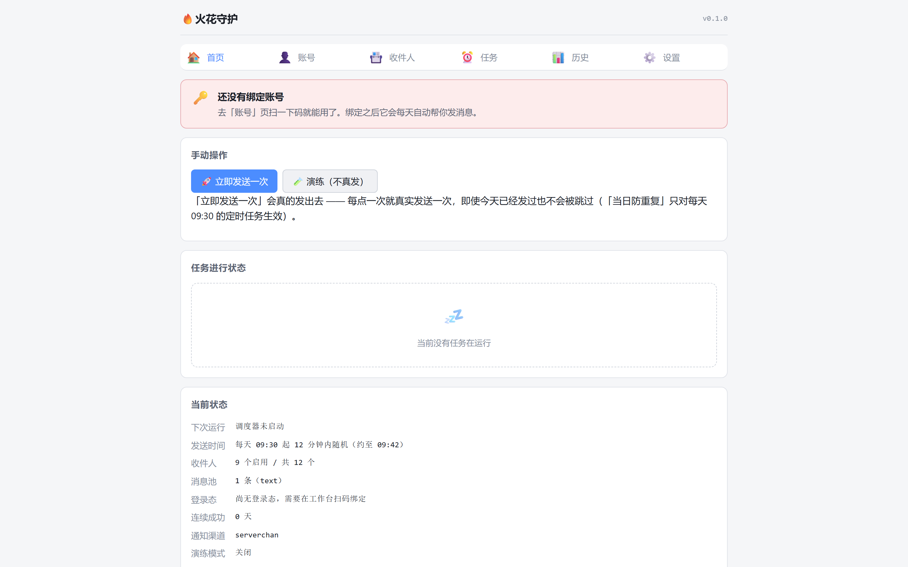
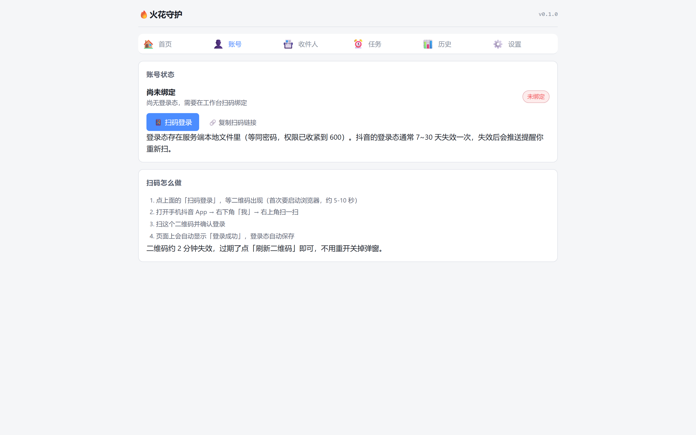
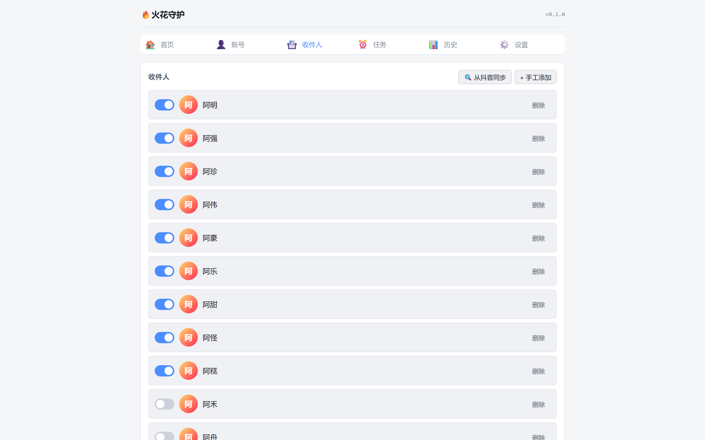
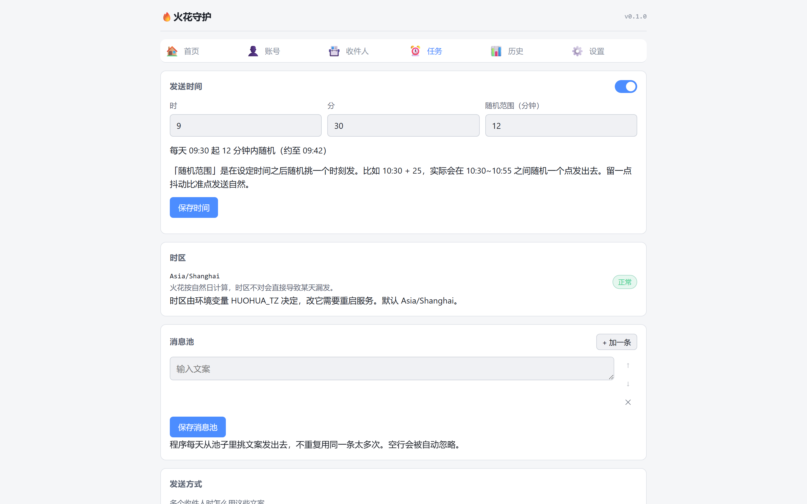

# douyin-huohua-keeper 🔥

> 让抖音「火花」不再因为出差、集训、住院、断网而断掉。
> 一个部署在你自己的服务器 / NAS / 树莓派上的自动续火工具，带网页工作台、扫码登录、分级告警。

[](./LICENSE)
[](https://www.python.org/)
[](https://playwright.dev/)
[](#docker-部署登录之后)
[](https://github.com/FROZZEENN/douyin-huohua-keeper/actions/workflows/ci.yml)



> 截图用的是演示数据。工作台首页：手动发一次、看当前状态、随时「演练」（不真发）。

> 🛠 **本项目由 [FROZZEENN](https://github.com/FROZZEENN) 以 vibe coding 方式完成**：
> 使用 **WorkBuddy**，配合 **DeepSeek V4.1 Flash** 与 **Tencent HY4 Preview** 模型。
> 完整说明见文末 [🛠 这个项目是怎么来的](#-这个项目是怎么来的)。

**目录**：
[⚠️ 先读这一段](#-先读这一段重要) ·
[它和别的轮子有什么不同](#-它和别的轮子有什么不同) ·
[🚀 快速开始](#-快速开始) ·
[工作台怎么用](#-工作台怎么用) ·
[支持的发送内容](#-支持的发送内容) ·
[告警级别](#-告警级别) ·
[架构一览](#-架构一览) ·
[开发](#-开发) ·
[路线图](#-路线图) ·
[常见问题](#-常见问题) ·
[贡献](#-贡献) ·
[⚖️ 免责声明](#-免责声明) ·
[🛠 这个项目是怎么来的](#-这个项目是怎么来的) ·
[许可证](#-许可证)

---

## ⚠️ 先读这一段（重要）

**这个项目是做什么的**

抖音的火花需要**双方在同一个自然日内都发过消息**才会累计，中断一天就归零。现实里总有事让人断掉：出差、集训、加班到凌晨、手机丢了、信号不好。

`douyin-huohua-keeper` 做的事情很单纯：**在你自己授权的前提下，每天在固定时间替你发一条消息给指定好友**，把火花的连续性保住。它不刷量、不做营销、不群发陌生人，只针对你自己维护的少数几个联系人。

**你必须知道的边界**

| 事项 | 说明 |
| --- | --- |
| 🚫 不是官方接口 | 抖音没有开放个人号私信 API，本项目通过浏览器自动化操作网页版会话页实现 |
| ⚠️ 存在账号风险 | 自动化行为理论上可能触发平台风控。**请务必使用小号或次要账号试跑，确认稳定后再用于重要账号** |
| 🔒 凭据在你手里 | 登录态文件只保存在你自己的机器上，从不外传。项目不包含任何遥测、不上报任何数据 |
| 📜 仅限个人用途 | 仅用于维护你本人与好友之间的正常社交互动，禁止用于骚扰、营销、批量加好友等行为 |
| ⚖️ 风险自担 | 使用本项目产生的一切后果（包括但不限于账号被限制）由使用者自行承担 |
| 🧍 **首次登录必须人工完成** | 抖音会对「陌生设备 + 自动化浏览器」要求**二级身份验证**（短信验证码 / 刷脸 / 登录密码）。这一步程序无法代劳，也不应该去规避 —— 见下一节 |

> 📌 完整的免责声明（6 条，含平台条款与风险边界）在文末 → [⚖️ 免责声明](#-免责声明)

### 🧍 关于「首次登录要人工做一次」

这是实测确认的硬约束，不是偷懒：

抖音识别出登录环境异常时，会在二维码扫描后要求**二级身份验证**。而这个验证弹窗
出现在浏览器页面里 —— **无头模式（没有界面）下你看不见、也点不到**，
表现就是「扫了码但永远登不上」。

所以正确的姿势是：

1. **在有图形界面的机器上**运行 `python scripts/login.py`，它会弹出一个**可见的浏览器窗口**
2. 你在那个窗口里扫码，并按提示**完成身份验证**
3. 登录态保存成功后，之后每天的自动发送**不需要再验证**（复用这份登录态）
4. 如果部署在服务器上：**在本地完成第 1~2 步，再把 `data/accounts/<id>.state.json` 拷到服务器**

> 这也意味着：**Docker / 云服务器无法独立完成首次登录**。
> 它们没有可交互的图形界面。请务必先在本地登录，再上传登录态。

**如果你只是想让火花别断，又不想折腾**

先看 [`docs/`](./docs)（施工中）里的替代方案章节 —— 有时候「让对方也开个提醒」比跑一个服务更划算。本项目适合的是那种「对方真的完全没法碰手机」的场景。

---

## ✨ 它和别的轮子有什么不同

很多同类脚本是「一次性小工具」：本机跑、终端里跑、失败了没人知道。轮到真的要托管两年的时候，问题全冒出来。这个项目专门解决那些问题：

| 能力 | 说明 |
| --- | --- |
| 🖥️ **网页工作台** | 打开浏览器就能扫码登录、改时间、选好友、看历史。**电脑和手机都能用**，不用 SSH 敲命令 |
| 📱 **远程扫码登录** | 浏览器把登录页的二维码渲染到网页上，你用手机扫一下就好。**首次登录会弹出二级身份验证，需要你在可见窗口里完成一次**（见上节） |
| 📷 **专用扫码页** | 内置 `/scan.html`：二维码每 2 秒自动同步刷新，不用怕过期；登录成功会实时提示 |
| 🎯 **每次自由选人** | 一次任务可以配多个收件人，也可以按天轮流。想今天发给 A、明天发给 B，在网页上点两下就行 |
| 🔁 **发送确认状态机** | 不是「按了回车就算发出去」，而是观察会话列表里该联系人的最后一条消息状态，确认真正落地才算成功 |
| 🧠 **错误四分类** | 区分「网络抖动可重试」「权限问题别重试」「登录态失效立即停」「疑似风控要降速」，而不是一律重试三次 |
| 📉 **五级分级告警** | NORMAL / NOTICE / WARNING / CRITICAL / RISK。连续失败 2 天提醒，3 天强提醒，登录态失效立刻叫你 |
| 🔐 **原子写 + 单实例锁** | 数据落盘先写临时文件再重命名，进程级互斥锁防止两个任务同时跑把状态搅乱 |
| 🛡️ **两阶段防重** | 发送前先「占位」，发送成功才「写成功」。中途崩溃也不会出现「发了两条」或「以为发了其实没发」 |
| 🐳 **Docker 一行起** | 官方镜像自带 Chromium 依赖，不需要你在宿主机上折腾 `playwright install` |

---

## 🚀 快速开始

### 开始之前（前置条件）

| 需要 | 说明 |
|---|---|
| **Python 3.11+** | `python -V` 确认。CI 里测过 3.11 / 3.12 / 3.13 |
| **一台有图形界面的电脑** | 首次登录要扫码、还可能要填验证码 —— **服务器上做不了**（见下一节） |
| 内存 | **2GB 起步**（Chromium 峰值约 800MB）；512MB 会 OOM |
| 磁盘 | 约 1GB（两个 Chromium 包 + 依赖） |
| 网络 | 能打开 douyin.com —— 先在浏览器里试一下 |
| 系统 | Windows 10+ / macOS / Linux（含树莓派）。**Docker 方式最省事** |

> **扫谁的码，就是用谁的账号。** 这个工具没有"公共账号"的概念：谁扫码，它就以谁的
> 账号和收件人名单去发。所以**每个人自己用，都要自己做一次第 0 步**
> （不要用别人给的文件 —— 登录态等同密码，而且换设备/换 IP 很容易失效）。

#### 国内网络：这两步最容易卡住

`pip` 和 `playwright` 的默认下载源都在境外，国内直连常常很慢甚至超时。加个镜像：

```bash
# ① pip 依赖走清华源
pip install -r requirements.txt -i https://pypi.tuna.tsinghua.edu.cn/simple

# ② Playwright 的浏览器包走国内镜像（Linux / macOS）
export PLAYWRIGHT_DOWNLOAD_HOST=https://cdn.npmmirror.com/binaries/playwright
# 反过来：在境外（或 GitHub Actions 上）构建请用官方源：
#   APT_MIRROR=official  PIP_INDEX_URL=https://pypi.org/simple/
playwright install chromium chromium-headless-shell
```

```powershell
# Windows PowerShell 里对应写法
$env:PLAYWRIGHT_DOWNLOAD_HOST = "https://cdn.npmmirror.com/binaries/playwright"
playwright install chromium chromium-headless-shell
```

> ⚠️ **两个浏览器都要装**：有头模式用 `chromium`，**无头模式用的是
> `chromium-headless-shell`**。只装 `chromium` 的话，无头跑起来会报
> `Executable doesn't exist` —— 而服务器/容器正是无头模式。

#### Linux 与 Docker 的两个权限坑

```bash
# ① 纯 Linux 用 venv 跑：Chromium 依赖一批系统图形库，要先装（需要 sudo）
sudo .venv/bin/playwright install-deps chromium
.venv/bin/playwright install chromium chromium-headless-shell

# ② Docker：容器内以 uid 10001 运行，而 data/、logs/ 是绑定挂载
mkdir -p data logs
sudo chown -R 10001:10001 data logs
```

> 忘记 chown **不会静默失败**：容器会明确告诉你 `data is not writable by uid 10001`
> 并给出上面那条命令（`docker compose logs` 里看）。

### 第 0 步：先在本地完成一次登录（**必做，不能跳**）

因为首次登录需要人工完成二级身份验证（见上文），所以**无论最终部署到哪里**，
都要先在本地有图形界面的机器上做这一步：

```bash
pip install -r requirements.txt
playwright install chromium chromium-headless-shell

python scripts/login.py          # 会弹出一个可见的浏览器窗口
```

> 已经有虚拟环境的话，直接 `./scripts/dev.sh setup`（Windows：`.\scripts\dev.ps1 setup`）
> 会把依赖和两个浏览器一次装好。

在弹出的窗口里：

1. 用手机抖音「扫一扫」扫描页面上的二维码
2. **如果出现「身份验证」，按提示完成它**（短信验证码 / 刷脸 / 登录密码，任选一种）
3. 看到提示「✅ 登录态已保存」就好了

产物是 `data/accounts/main.state.json`。**它是敏感文件，等同于你的登录凭据，不要外传。**

### Docker 部署（登录之后）

```bash
git clone https://github.com/FROZZEENN/douyin-huohua-keeper.git
cd douyin-huohua-keeper
cp .env.example .env      # 改一改里面的令牌和通知配置
mkdir -p data/accounts
cp /path/to/your/main.state.json data/accounts/   # ← 把本地登录好的凭据放进来
docker compose up -d
```

然后浏览器打开 `http://<你的服务器IP>:8787`，用 `.env` 里设的令牌登录即可。

> ⚠️ **不要在服务器上尝试首次登录。** 容器里没有可交互的图形界面，
> 二级身份验证弹窗你点不到，会一直卡在「需在手机上进行确认」。
>
> 云服务器记得在安全组里放行 8787 端口，**并且务必改掉默认令牌**。更好的做法是只允许你自己的 IP 访问（见 `.env.example` 里的 `HUOHUA_ALLOWED_IPS`）。

### 本地运行（开发 / 试用）

最省事的是用自带脚本（自动建虚拟环境、装依赖、下载浏览器）：

```bash
# Linux / macOS / Git Bash
./scripts/dev.sh setup
./scripts/dev.sh run          # 有头模式：能看见浏览器在干什么，排查选择器最有用
```

```powershell
# Windows 原生（不需要 Git Bash）
.\scripts\dev.ps1 setup
.\scripts\dev.ps1 run
```

想手动来也行：

```bash
python -m venv .venv
source .venv/bin/activate        # Windows: .venv\Scripts\activate
pip install -r requirements.txt
pip install -e .                 # 装成本地包，python -m douyin_huohua_keeper 才找得到
playwright install chromium chromium-headless-shell

cp .env.example .env
python -m douyin_huohua_keeper
```

> ⚠️ **`chromium-headless-shell` 别漏装**：无头模式用的是它，只装 `chromium`
> 的话无头跑起来会报 `Executable doesn't exist` —— 而服务器正是无头模式。

> 💡 本地启动默认**不启用定时任务**（只起工作台），避免和服务器上的实例抢着发。
> 确实要本机定时：`./scripts/dev.sh run --with-scheduler`。

直接 `python -m douyin_huohua_keeper` 时默认是**无头模式**（`HUOHUA_HEADLESS=true`）；
而 `dev.sh run` / `dev.ps1 run` 会自动切成**有头模式**，弹出真实浏览器窗口 ——
排查选择器问题时看着它点，比读日志快得多。

另外内置了一个专用扫码页：启动后打开 `http://127.0.0.1:8787/scan.html` ——
二维码会自动同步刷新，不用怕过期。

### 本地实例和云服务器实例，是什么关系？（**重要**）

**一个抖音账号，只让一个实例负责定时发送。**

| | 本地实例（你这台电脑） | 云服务器实例 |
|---|---|---|
| 用途 | **首次登录**（要图形界面）、有头调试、手动补发 | 每天 09:30 的定时自动发送 |
| 调度器 | 建议关掉 | 开 |
| 数据目录 | 默认 `./data`，可用 `HUOHUA_DATA_DIR` 挪到别处 | 容器挂载的 `data/` |

本地只想调试、不想让它自己定时发的话：

```bash
HUOHUA_ENABLE_SCHEDULER=false python -m douyin_huohua_keeper
```

> ⚠️ 两个实例**不要**共用同一份 `data/accounts/*.state.json`，也**不要**同时开着定时任务。
> 同一账号在两个 IP 上各跑各的定时，是最容易触发风控的形态；
> 而且一边重新登录，另一边的会话就可能失效（互相顶号）。
> 登录态文件等同密码：在两台机器之间拷贝时想清楚，别放进网盘。


---

## 🧭 工作台怎么用

```
┌──────────────────────────────────────────────────────┐
│  🔥 douyin-huohua-keeper                             │
├──────────────────────────────────────────────────────┤
│  🏠概览  👤账号  📇收件人  ⏰任务  📊历史  ⚙️设置      │
├──────────────────────────────────────────────────────┤
│                                                      │
│  账号状态   ✅ 已登录（剩余有效期约 11 天）           │
│            [ 开始扫码 ]                              │
│                                                      │
│  今日结果   ✅ 成功 1/1   2026-09-15 17:20:58         │
│  连续成功   1 天                                     │
│                                                      │
│  下一步     ⚠ 定时发送是关闭的，去「任务」页打开它    │
│                                                      │
└──────────────────────────────────────────────────────┘
```

> 概览页会用一条「下一步该做什么」的提示把你导向对应标签页 ——
> 新装的实例会依次提醒你「绑账号 → 加收件人 → 开定时」。

三个关键页面长这样（截图用的是演示数据）：

| 账号 | 收件人 | 任务 |
| --- | --- | --- |
|  |  |  |

另外内置一个**专用扫码页** `/scan.html`：
它把二维码单独放在一个页面里、每 2 秒自动同步刷新（抖音的登录码只有 1~2 分钟寿命），
并实时显示「等待扫码 / 已扫描请去手机确认 / 登录成功」。第一次登录建议直接用它。

> 账号页有「复制扫码链接」，可以把带令牌的链接发到另一台设备打开。
> ⚠️ 令牌会留在**浏览器历史 / Referer / 访问日志**里，所以这种链接**仅用于首次打开**，
> 之后浏览器会记住令牌。更多注意事项见 [SECURITY.md](SECURITY.md#关于工作台令牌部署者必读)。

1. **绑定账号** —— 打开「账号」页点「开始扫码」，页面出现二维码，手机抖音扫一下，
   然后在手机上**点「确认登录」**（这一步最容易漏）。
   若抖音弹出二级身份验证，建议改用 `python scripts/login.py` 在**可见窗口**里完成。
2. **同步收件人** —— 登录成功后拉取最近会话列表，勾选你想保火花的联系人。
3. **配置任务** —— 设定每天几点发、发什么（固定文案 / 文案池随机 / 表情 / 图片）、发给谁（指定 / 轮流）。
4. **看历史** —— 每次执行都有记录：几点发的、发给谁、成功还是失败、失败原因是什么。

---

## ⚙️ 支持的发送内容

| 类型 | 说明 |
| --- | --- |
| `text` | 纯文本。留空则从预设文案池里随机挑一条 |
| `sticker` | 表情。支持按描述、无障碍标签、属性、序号四种方式定位 |
| `image` | 图片。从本地上传的素材里选，或直接指定路径 |
| `random` | 以上几种随机组合，显得不那么机械 |

**为什么要有文案池**：连续 700 天发同一个「早」，肉眼都能看出是机器。文案池 + 随机抖动间隔，让行为更像人（当然，这只是降低观感上的机械感，不能规避平台风控）。

---

## 📊 告警级别

| 级别 | 触发条件 | 是否默认推送 |
| --- | --- | --- |
| `NORMAL` | 一切正常 | 否 |
| `NOTICE` | 单次失败但重试成功 | 否 |
| `WARNING` | 连续失败 2 天 | 是 |
| `CRITICAL` | 连续失败 3 天 | 是（强提醒） |
| `RISK` | 登录态失效 / 疑似风控 | 是（立即） |

支持的通知通道：**Bark / Server酱 / 钉钉机器人 / 飞书机器人 / Telegram / 通用 Webhook**。通道本身也带重试和失败降级 —— 通知发不出去这件事本身不应该让你的主流程静默失败。

---

## 🏗️ 架构一览

```
douyin-huohua-keeper/
├── src/douyin_huohua_keeper/
│   ├── models.py          # 数据模型（不可变，带校验）
│   ├── config.py          # 环境变量与配置文件加载
│   ├── engine/            # ★ 核心：浏览器驱动、会话定位、发送确认
│   ├── workbench/         # ★ 网页工作台（FastAPI + 原生前端）
│   │   ├── routes/        #   REST API
│   │   └── static/        #   前端页面（无构建步骤）
│   ├── scheduler/         # 进程内定时调度（APScheduler）
│   ├── notify/            # 多通道分级告警
│   └── store/             # 原子写 / 文件锁 / 运行历史
├── data/
│   ├── accounts/          # 登录态（.gitignore，绝不入库）
│   ├── config/            # 任务与联系人配置
│   └── runs/              # 运行历史
├── docs/                  # 文档与教程
├── deploy/                # Docker / systemd / 云平台部署辅助
├── scripts/               # 开发与运维脚本
└── tests/                 # 单元测试 + 集成测试
```

**设计原则**

- **存储极简**：配置和历史用 JSON 文件，不引入数据库。个人自用场景下，SQLite 和 JSON 的差别只在「要不要多装一个依赖」。
- **前端零构建**：原生 HTML/CSS/JS，没有 `npm install`，没有打包步骤。你想改个按钮颜色，直接开文件改。
- **失败要响**：任何静默 `except` 都是 bug。要么分类处理，要么上报，不允许「记录日志然后假装没事」。
- **可观测**：每次运行产出一份 `RunReport`，包含每个收件人的结果和失败分类，网页上直接看。

---

## 🧪 开发

```bash
pip install -r requirements-dev.txt
pytest                      # 跑测试
pytest --cov                # 带覆盖率
ruff check src tests        # 静态检查
ruff format src tests       # 格式化
python scripts/healthcheck.py   # 自检：环境、依赖、存储、通知通道
```

提交前请确保 `ruff check` 和 `pytest` 都是干净的。

> 这些检查**每次 push 都会在 CI 上自动跑**（见 `.github/workflows/ci.yml`）：
> Python 3.11 / 3.12 / 3.13 + Windows + macOS 五个组合，外加 ruff、eslint 和 Docker 构建。
> 所以提 PR 时不需要在本地把每种环境都试一遍 —— 但请保证至少一种环境是绿的。

---

## 🗺️ 路线图

| 阶段 | 内容 | 状态 |
| --- | --- | --- |
| S0 | 项目骨架与规范（README / Docker / CI / 部署脚本） | ✅ |
| S1 | 数据模型 · 配置 · 存储层（原子写 / 文件锁 / 仓库） | ✅ |
| S2 | 浏览器管理 · 登录态校验 | ✅ |
| S3 | 会话定位 · 发送确认状态机 ← **里程碑：能真正发出消息** | ✅ |
| S4 | 错误分类 · 重试 · 防重 | ✅ |
| S5 | 分级告警 · 多通道 | ✅ |
| S6 | 扫码登录模块 | ✅ |
| S7 | 工作台后端 API | ✅ |
| S8 | 工作台前端页面 ← **里程碑：可视化完成** | ✅ |
| S9 | 定时调度 · 错峰 | ✅ |
| S10 | 测试补全 · 文档 · 教程 ← **里程碑：可开源** | 🚧 进行中 |

> S3 里程碑已于 **2026-09-15** 在真实账号上验证通过：完整走通
> 「加载登录态 → 定位会话 → 校验头部名字 → 输入 → 点击发送 → 状态机确认送达」，
> 全程 1.3 秒，未触发重试。

后续计划：

- 补齐 `scheduler` / `workbench` 层的测试覆盖
- 故障排查手册与图文教程
- 更多通知通道（企业微信 / 邮件 / Discord）

---

## ❓ 常见问题

**Q：会不会被封号？**
A：有可能。任何非官方自动化都有这个风险，本项目不能给你任何保证。降低风险的做法：只维护少数几个联系人、发送频率贴近真人、文案和间隔加随机、用小号先跑一段时间观察。**不要用你的主号当第一个试验品。**

**Q：登录态过多久失效？**
A：实测 `sessionid` 的有效期在 7~30 天之间波动，保守按 7~14 天估算。失效时工作台会显示状态并在当天推送 `RISK` 级告警。

**Q：重新登录要多久？**
A：扫码本身只要几秒，但**可能触发二级身份验证**（短信验证码 / 刷脸 / 登录密码）。
这一步需要你能拿到该账号的某种凭据，无法由程序代劳。所以「完全无人值守运行两年」
这个目标存在硬约束 —— 请提前想好失效时谁能去点那一下。

**Q：为什么我扫了码却一直登不上？**
A：最可能的原因有三个，按概率排：

1. **只扫了码，但没在手机上点「确认登录」** —— 这是最常见的。扫码只是告诉抖音「我想登录」，
   手机上那一下确认才是真正的授权。
2. **抖音弹出了「身份验证」需要你完成** —— 无头模式下你看不到这个弹窗，请用
   `python scripts/login.py` 在可见窗口里做。
3. **二维码过期了** —— 抖音的登录码只有 1~2 分钟寿命。用内置的 `/scan.html`，它会自动换新。

**Q：能不能完全不登录，用接口？**
A：不能。抖音的私信 OpenAPI 只对认证企业号 / 小程序品牌号开放，而且要求用户先发消息触发回调，个人号无法主动发起会话。这条路走不通。

**Q：为什么不用数据库？**
A：个人自用的数据量是「一年几百条运行记录」，JSON 足够。少一个依赖就少一个出问题的地方。

**Q：我想保 20 个人的火花怎么办？**
A：可以配，但请认真评估：多账号 / 多收件人会显著提高自动化特征，风险不成正比上升。这个工具的设计目标是「帮你守住那两三个真的不能断的人」。

---

## 🤝 贡献

欢迎提 Issue 和 PR。特别欢迎这几类：

- 新的通知通道（企业微信、邮件、Discord……）
- 更稳的会话定位策略（抖音前端改版很频繁）
- 文档补充、错别字修正、教程投稿

提交前请跑一遍 `ruff check` 和 `pytest`。

---

## ⚖️ 免责声明

**请在使用前读完这一节。** 它不是形式主义 —— 这个项目做的事情有真实的边界和风险。

**1. 这是非官方工具，与抖音没有任何关系。**
本项目不使用、也不依赖任何官方接口或授权。它是通过浏览器自动化操作网页版完成的。

**2. 自动化操作违反平台用户协议。**
抖音的用户协议对自动化行为有明确限制。使用本项目**可能导致账号被限制、风控或封禁**。
降低风险的做法（也只降低，不消除）：**用小号先跑**、只维护少数几个联系人、
发送频率贴近真人、文案与间隔加随机。**不要拿主号当第一个试验品。**

**3. 风险由使用者自行承担。**
作者不对任何后果负责，包括但不限于账号受限、数据丢失、消息误发漏发、
以及因使用本项目而产生的任何直接或间接损失。

**4. 本项目明确不做"规避风控"。**
代码里没有任何伪装成真人、绕过检测、隐藏自动化特征的手段。
一些参数（如 `--no-sandbox`）是为了在容器里跑得起来，不是为了伪装。
如果你需要的是"更难被发现"，这个项目不适合你。

**5. 登录态等同密码。**
`data/accounts/*.state.json` 里是你账号的会话凭据。不要提交、不要外传、不要放网盘。
`data/` 和 `.env` 都已在 `.gitignore` 里。

**6. 请只用于你自己的账号和你自己的人际关系。**
不要用它去骚扰、群发广告，或对不希望你这么做的人使用。
这不是技术限制，是这个项目希望你遵守的边界。

---

## 🛠 这个项目是怎么来的

**完全由我用 vibe coding 的方式做出来** —— 从第一行代码到这篇文档。

| | 角色 |
| --- | --- |
| 🧑‍💻 **[FROZZEENN](https://github.com/FROZZEENN)** | 提需求、做取舍、验收结果；所有「这样做到底对不对」的判断 |
| ❄️ **WorkBuddy** | AI 编程助手，承担实现、重构、测试与文档的具体编写 |
| 🧠 **DeepSeek V4.1 Flash** | 驱动模型之一 |
| 🧠 **Tencent HY4 Preview** | 驱动模型之一 |

代码、测试、文档、CI 里那些修复的具体编写，都在这几个模型的协助下完成。
我做的是：决定要什么、判断对不对、以及为结果负责。

> **归功可以分给模型，责任不行。**
> 自动化操作第三方平台意味着什么、这个工具该不该存在、以及它有没有被正确使用 ——
> 这些判断由我做出，也由我承担。

---

## 📄 许可证

[MIT](./LICENSE)。你可以自由使用、修改、分发，包括商用 —— 但请保留版权声明，并且**自己承担使用风险**。

---

## 💡 最后

火花本身只是一个数字图标，值钱的是它背后那段「我们每天都会说句话」的默契。

这个工具能做的只是别让这个默契断在一个谁都没空看手机的晚上。剩下的 —— 该聊天还是得聊天。

<sub>Made with ❄️ for people who don't want to lose their streak.</sub>
